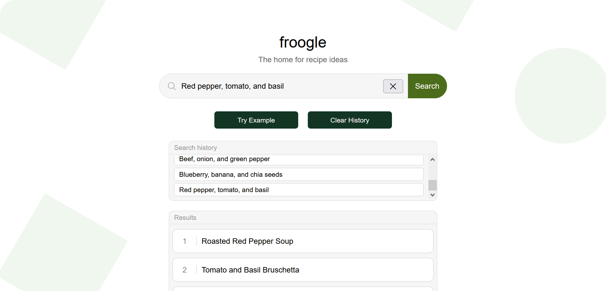

# froogle



## Introduction

froogle is an application gives recipe ideas from ingredients you provide. The purpose of this project is to strictly give ideas for what to cook as opposed to giving actual recipes which one can easily find with a quick search.

## Background

We've first started this project at a hackathon. There wasn't any single required theme, but one recommendation was to make something based on the topic of food. Having that topic in mind and knowing that there is an API available to interact with ChatGPT, we eventually came up with the idea for this app.

## Requirements

- Node.js
- Python

## Installation

Before even getting into the installation process, you'll first need an API key from [OpenAI](https://openai.com/) which you can get [using this link](https://platform.openai.com/account/api-keys). Note, you'd first need to create an account if you don't have one already.

1\) To begin, first, clone the repository.

```
git clone https://github.com/mhmh4/froogle.git
```

2\) Create a `.env` file within the `api` directory. In that file, add your OpenAI API key in a variable named `OPENAI_API_KEY`, like so:

```
OPENAI_API_KEY=your-api-key-here
```

3\) Next, still in the `api` directory, install the required Python packages (use a virtual environment if you're feeling best practice-y).

```
pip install -r requirements.txt
```

4\) Back in the project's root directory, install the required npm packages.

```
npm install
```

## Usage

1\) In one terminal, navigate to the `api` directory (activate your virtual environment if you're using one), then run the following Flask command:

```
flask run
```

2\) In a second terminal, run the npm `dev` script from the project's root directory.

```
npm run dev
```

3\) Open a web browser and navigate to `http://localhost:5173` to see the application.

## What could be next for froogle?

Here are just some ideas:

- Improve the UX by adding photos or videos.
- Create our own API of the application.
- Add a new, different feature that's still related to the theme.
